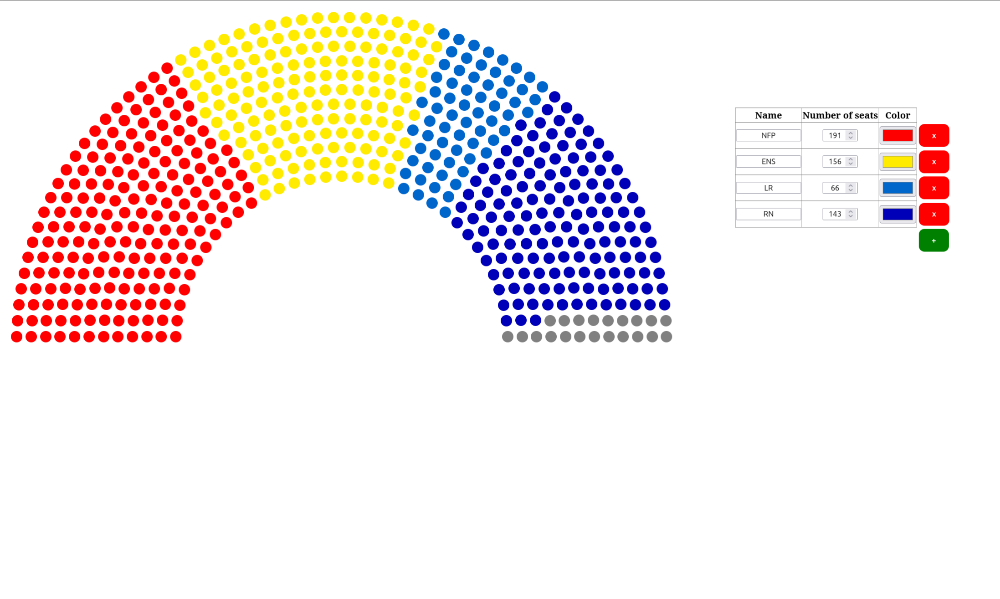

## French National Assembly Simulator

This project is a small simulator of the French National Assembly.
You can create or remove parties, change their number of seats or the color used.

## Dependencies
- node.js
- express

Run:
```bash
npm install express
```

## Run (local deployment)

To start the project, just launch the following command
```
node server.js
```

and open a browser at the address: http://localhost:5000.

## Video

[](https://youtu.be/-1Bb64Et-7M)

## Illustrations


